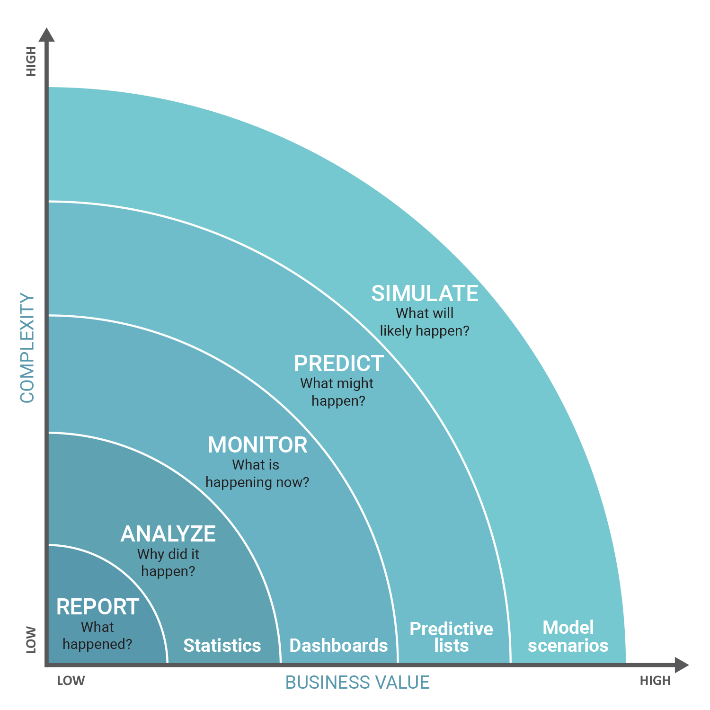
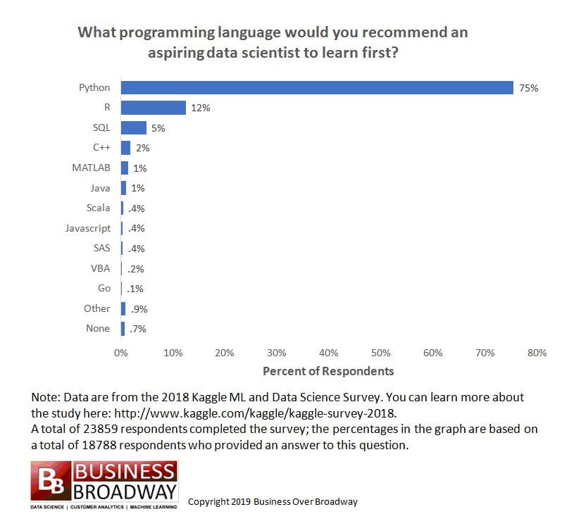
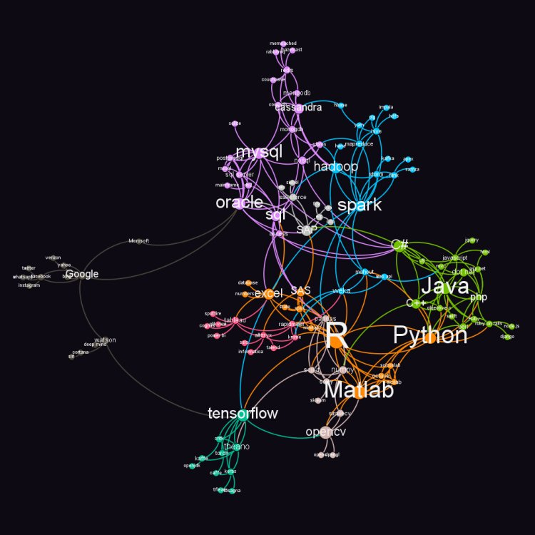
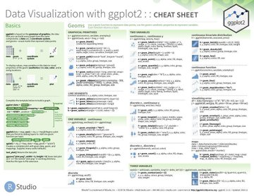
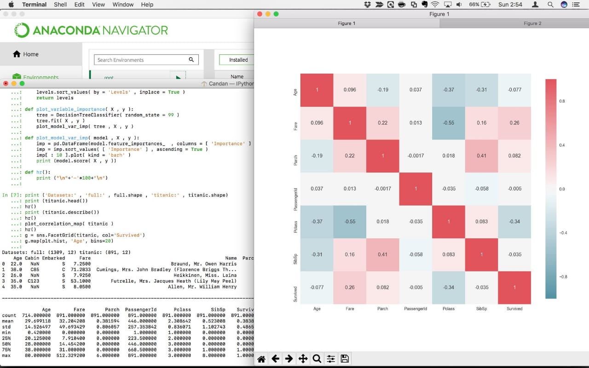
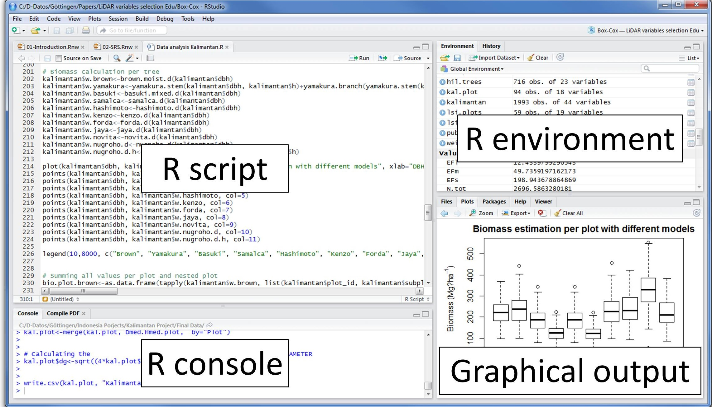

```{r setup, include=FALSE}
knitr::opts_chunk$set(echo = TRUE)
```

## Agenda {.tabset .tabset-fade .tabset-pills}

+ Welcome!
+ Getting Started with R Programming
+ R_Basico_1.0
+ R_Basico_1.1
+ R_Basico_1.2
+ R_dplyr

&nbsp;

### Welcome!

`OBJETIVO:` **Presentación y breve panorama de lo que haremos las próximas semanas**

&nbsp;

Funcionamiento de nuestro cerebro.

&nbsp;

```{r echo=F, fig.cap="Clear your minds!!!", out.width = '50%'}

```

&nbsp;

Hay que ubicarnos en donde estamos en base a lo que hacemos actualmente. No todo lo que hacemos hoy esta mal, pero hay aún mas cosas que aprender. 

&nbsp;

```{r echo=F, fig.cap="Dónde estamos?", out.width = '60%'}

```

&nbsp;

La generación e ingesta de datos hoy es una necesidad, debemos contar con mejores herramientas para el manejo de los mismos. Es muy util en nuestras vidas se consumidores, pero mucho mejor ser generadores y controladores de ellos. 

&nbsp;

```{r echo=F, fig.cap="Datos everywhere!", out.width = '60%'}

```

&nbsp;

Debemos de empezar por algo, los diferentes lenguajes de programación y otras herramientas denominadas Open Source son un excelente comienzo!!

&nbsp;

```{r echo=F, fig.cap="Python y R para empezar", out.width = '60%'}

```

&nbsp;

Necesitamos ver el ecosistema, nuestra realidad y tomar la mejor decisión para ver por donde empezamos, todos los lenguajes son utiles, pero no podemos saberlo todo.

&nbsp;

```{r echo=F, fig.cap="Ecosistema de R", out.width = '60%'}

```

&nbsp;

Para discutir la próxima sesión, revisen el articulo, al inicio de cada sesión comentaremos algo similar, ya sea dudas de ustedes ó buenos articulos que recomendaré.

https://www.makeuseof.com/tag/how-programming-affects-brain/


&nbsp;

Dudas del Open Source, revisen el siguiente Link https://www.gnu.org/licenses/quick-guide-gplv3.html y naveguen.


&nbsp;

### Getting Started with R Programming

`OBJETIVO:` **Breve historia de R y contexto**

&nbsp;

#### Historia de R

&nbsp;

Ross Ihaka and Robert Gentleman desarrollaron `R` como un software *free* cuando impartían clases en la Universidad de Auckland en New Zealand a principios de 1990. 

Lo crearon a partir del lenguaje estadístico denominado `S` y para diferenciar su trabajo usaron una sintaxis similar para su propio uso. En 1993 anunciaron su colaboración en las noticias del mailing list de `S`, muchas personas se interesaron y se sumaron a la colaboración. Dicha colaboración sigue en pie en el sitio https://www.r-project.org/ 

El lanzamiento oficial (1.0.0) fue en Febrero del 2000, para ese entonces ya era parte de la fundación de software libre GNU. Actualmente la última versión (3.6) está disponible desde Abril de este año para más de 30 países.

&nbsp;

#### Ventajas y usos de R

&nbsp;

Es un software que ayuda a la manipulación de datos, cálculos aritméticos y visualización de gráficos dinámicos. 

El código es de fácil escritura y comprensión.

Excelente para el cálculo de matrices, vectores, algoritmos complejos.

Existe una colección muy amplia de herramientas para el análisis de datos, visualización y otros propósitos. `dplyr`, `data.table`,  `tidyr` y `ggplot2` algunos de ellos.

Fácil desarrollo de herramientas con buen nivel de interacción como `blogdown` y `xaringan`.

&nbsp;

#### Iniciando

&nbsp;

Para descargar e instalar `R` en su última versión, deberán utilizar el siguiente link https://cran.r-project.org/bin/windows/base/  donde encontraran la versión para Windows que es el sistema operativo que todos tenemos.

Un lenguaje amigable, fácil de usar y entender, simple y efectivo.

Con `R` se distribuyen algunos paquetes, pero existen muchos más en el sitio CRAN, cubriendo así un amplio espectro de herramientas estadísticas, de cálculo y de visualización que les harán más divertida la vida.

El link con todo el material del curso esta en mi repo personal de Git, tengan cuidado de no aruinarlo, luego hacemos otro curso de Git. https://github.com/ricardolastra/Workshop_Seguros

En los próximos días les hare llegar documentos como estos, los cuales les serán de gran apoyo con cosas básicas, no podemos retener todo en mente, además que no cubriremos muchos comandos, ejemplos y funciones de las paqueterías.


&nbsp;

```{r echo=F, out.width = '50%'}

```

&nbsp;

Para las siguientes sesiones usaremos una interface muy "Fancy" denominada RStudio, la cual podrán descargar en el siguiente link https://www.rstudio.com/products/rstudio/download/ que los llevara a tener la versión más reciente 1.2.1335

Existen más programas o UI´s muy padres, Anaconda (luego revisan el siguiente link) https://www.anaconda.com/distribution/ tiene excelentes herramientas con Python y aun para R. Sin embargo una de las mejores herramientas con R es RStudio. 

No nos perdemos de mucho, échenle un ojo.

&nbsp;

```{r echo=F, out.width = '60%'}

```

&nbsp;

##### *Están listos?*


### R_Basico_1.0

`OBJETIVO:` **Vistazo de Rstudio y primeros comandos**

&nbsp;

Recordando...

*R es un lenguaje computacional diseñado para la estadística.* 

* Es gratis
* Amplias librerias
* Basto soporte, mailing list, blogs, tutoriales
* De facíl desarrollo
* Desarrolado por estadísticos

&nbsp;

Recuerden que cualquier cosa que escriban en R muy probablemente no seran los primeros en intentarlo, hay una gran posibilidad que alguien ya haya escrito  algun paquete justo para lo que necesitan.

Hecharemos un vistazo a la parte basica de RStudio que nos permitira entender el funcionamiento del lenguaje, sus alcances, sus aplicaciones y sus ventajas sobre las herramientas actuales que conocemos.

&nbsp;

```{r echo=F, out.width = '70%'}

```

&nbsp;

Inicien RStudio y abran un R script:

* En Windows click en el boton de Inicio y busquen Rstudio.
* Ya en Rstudio den click en  `File -> New File -> R script` 
* Guardenlo en su carpeta del curso  `File -> Save As -> ruta a su carpeta y nombre del file`

Ahora traten de reproducir las siguientes notas.

Nota. Recuerden el simbolo `#` para comentar su codigo. 
  
&nbsp;

**FORMAS DE DECLARAR Ó GUARDAR Ó ALMACENAR Ó MANTENER VARIABLES:**
```{r }
x = 3
y <- 4
5 -> z
```

**Asi estan almacenadas en el ambiente:**

```{r }
x
y
z
```

Nota. Los valores que guardamos pueden ser usados en subsecuentes operaciones, recuerden que lo mas limpio es poner el nombre a la izquierda y los valores a la derecha.

&nbsp;

**SOBRESCRIBIR VARIABLES:**
```{r }
x = 4
y <- 5
6 -> z
```

**Asi estan almacenadas en el ambiente:**

```{r }
x
y
z
```

**CALCULOS BASICOS:**

Operadores
```{r ,warning=F, error=F, message=F}
#SUMAS
25+25
x+y
#MULTIPLICACIONES
35*2
#DIVISIONES
x/y
#RESTAS
z-x-y
#Potencias
3^2
y^x
```

**CALCULOS BASICOS**

FORMAS DE **NO** HACER CALCULOS BASICOS, ASI NO ES LA SINTAXIS DE R:
```{r ,warning=F, error=F, message=F}
#SUMAS
#=25+25

#MULTIPLICACIONES
#(35)(2)
```

**VECTORES**

```{r }
#Basicos
x <- c(1,4,3,1,3,2,2,2)
x[1]
x[2]
x[2:4]
x[-1]
x[-4]
x[x<=3]
#Función which (más adelante veremos, for, while, ifelse)
#Devuelve la posición del elemento que pidamos validar.
which(x==1)
#Quizá con el alfabeto es más claro.
which(letters == "g")
x==1
#Mas complejos con operaciones, guardamos vectores
Cebollas.huacal <- c(12,4,4,6,9,3)
Chiles.caja <- c(5,3,2,2,12,9)
#Multiplicamos vectores
Cebollas.precio <- Cebollas.huacal *200
Chiles.precio <- Chiles.caja *100
#Sumamos vectores
Cebollas.precio + Chiles.precio
#Tambien lo podemos hacer asi en 1 sola linea
Cebollas.huacal *200 + Chiles.caja *100
```

**OBJETOS**

```{r }
objeto <- 3*3
```

**FUNCIONES**
```{r }
myfun = function(x, y){
  return (x*y)
}
myfun(3,4)

myfun2 = function(x, n=2){
  return(x^n)
}
myfun2(4)
myfun2(2, n=3)
```

**R LOOP´S** (While - For)

Sintaxis *WHILE*:

<style>
div.blue { background-color:#e6f0ff; border-radius: 5px; padding: 20px;}
</style>
<div class = "blue">

while (test_expression){
  statement
  }

</div>

&nbsp;

```{r }
i <- 1
while (i < 6) {
  print(i)
  i = i+1
  }
```
&nbsp;

Sintaxis *FOR*:

<style>
div.blue { background-color:#e6f0ff; border-radius: 5px; padding: 20px;}
</style>
<div class = "blue">

for(var in seq){
  expr
  }

</div>

&nbsp;


```{r }
for (año in c(2014,2015,2016,2017,2018,2019)){
  print(paste("El año actual es", año))
}
```
&nbsp;

Aún mejor...

```{r }
for (año in 2014:2019){
  print(paste("El año actual es", año))
}
```
&nbsp;

lo ideal...

```{r }
años <- c(2014,2015,2016,2017,2018,2019)
for (i in años){
  print(paste("El año actual es", i))
}
```
&nbsp;

**R FUNCTION´S**  (Ifelse - Which)


Sintaxis *IFELSE*:

<style>
div.blue { background-color:#e6f0ff; border-radius: 5px; padding: 20px;}
</style>
<div class = "blue">

ifelse(test, yes, no)

</div>

&nbsp;


```{r }
plazo <- c(6,9,12,24,30)
ifelse(plazo==9, "aplica" , "no aplica")
```
&nbsp;

más divertido...

```{r }
plazo <- c(6,9,12,24,30)
ifelse(plazo>=9 & plazo<=24, "aplica" , "no aplica")
```
&nbsp;

Sintaxis *WHICH*:

<style>
div.blue { background-color:#e6f0ff; border-radius: 5px; padding: 20px;}
</style>
<div class = "blue">

which(x, arr.ind = FALSE, useNames = TRUE)

</div>

&nbsp;


```{r }

which(letters == "g")

```
&nbsp;

Nota. Para más detalles consulten los documentos de apoyo del repo de git en el documento `refcard_2.0_operators_others`

&nbsp;

### R_Basico_1.1

`OBJETIVO:` **Como cargar datos, paquetes y librerias**

&nbsp;


Cargando nuestros datos

R tiene algunas formas de leer archivos, los mas comunes son tablas, archivos planos, archivos con alguna codificacion especifica o estructurada. Aunque no sera el objetivo del curso, leer cadenas de texto, datos sin estructuras definidas o espcificas y archivos sin algun tipo de orden, es algo que tambien se puede hacer en R. 

Para leer datos de un archivo, primero deben saber que tipo de archivo es, es decir, su extension. La tabla de abajo muestra una lista de funciones que pueden ser importadas segun el formato del archivo.

  tipo de datos                 funcion         paquete 
  ------------------------- ---------------  --------
  comma separated (.csv)    `read_csv()`     readr
  other delimited formats   `read_delim()`   readr
  R (.Rds)                  `read_rds()`     readr
  Stata (.dta)              `read_dta()`     haven   
  SPSS (.sav)               `read_spss()`    haven   
  SAS (.sas7bdat)           `read_sas()`     haven   
  Excel (.xls, .xlsx)       `read_excel()`   readxl  
  regular delimited files   `fread()`        data.table 


Nota. Mas información ver documento de apoyo `data-import`

&nbsp;

Paqueterias de R ó los famosos *packages*

Los paquetes de R pueden ser instalados desde el famoso CRAN, el cual es una red de archivos de alta gama. Para ello deberán  usar la función `install.packages`. Cuando instalan un paquete ponen una copia en la computadora de forma local, pero aun no lo hace "usable", solo esta "disponible". Para usarlo deberan adjuntar o cargar la funcion de `library`.

Gracias a nuestro amigo Hadley y otros colaboradores, en este curso usaremos para prueba de carga el famoso "the tidyverse". `Tidyverse` nos brinda grandes herramientas para manipulación basica y avanzada de datos, es muy funcional, facíl e intuitiva. 

&nbsp;

```{r, eval=FALSE}
install.packages("tidyverse")
```
```{r}
library(tidyverse)
```

&nbsp;

Nota. Ayuda en  R

Podemos usar la función `help` o el operador al inicio de cada sentencia `?`.

```{r}
#help(help)
#?str
```

&nbsp;

Cargando nuestro primer archivo:

```{r}
read_csv("bases/PRIMAS_EJE_CARGA.csv")
```

UPS!! Problemas!!!

&nbsp;

Hagamos que este disponible la libreria...

```{r}
library(readr)
read_csv("bases/PRIMAS_EJE_CARGA.csv")
```

Clasico de SIISA y nuestros amigos de TI!!!

&nbsp;

```{r}
library(readr)
read_csv("bases/PRIMAS_EJE_CARGA.csv", skip = 2)
```

&nbsp;

```{r}
primas <- read_csv("bases/PRIMAS_EJE_CARGA.csv", skip = 2, n_max = 5)
```

&nbsp;

```{r}
#install.packages("data.table")
library(data.table)
primas_fread <- fread("bases/PRIMAS_EJE_CARGA.csv", skip = 2, sep = ",")
head(primas_fread,5)
```

&nbsp;

Ahora validamos ó exploramos los datos que cargamos en el ambiente con las siguientes funciones estadísticas

```{r}
class(primas_fread)
```

&nbsp;

Podemos obtener aún más

```{r}
library(dplyr)
glimpse(primas_fread)
```

&nbsp;

Un poco más

```{r}
str(primas_fread)
```

&nbsp;

la mejor información!!!

```{r}
summary(primas_fread)
```

&nbsp;

El artículo a discutir al inicio de la sesión numero 3 es el siguiente:

https://www.elfinanciero.com.mx/tech/por-que-tus-hijos-deberian-aprender-a-programar

&nbsp;

### R_Basico_1.2

`OBJETIVO:` **Manejo de datos**

&nbsp;

Normalmente los datos en R son almacenados como `data.frame`

Un data.frame es una lista de vectores de la misma longitud, piensenlos como una tabla de observaciones (individuos), cada entrada del vector en la lista forma una columna, cada columna puede ser de diferente tipo, conocemos a las columnas como variables y a las filas como observaciones.

Un data.frame tiene entonces dos dimensiones correspondientes al numero de filas y columnas, en ese estricto orden. 

Empezaremos a hacer nuestros primeros subsets, muy utiles en la vida real.

&nbsp;

Empezamos con un clasico, `filter`

```{r}
filter(primas_fread, PLAZO == 34 & SEXO == "F")
```


```{r}
filter(primas_fread, PLAZO == 3, NOMBRE %in% c("AARON", "RICARDO"))
```

&nbsp;

Buen acceso a ciertas observaciones, `slice`

```{r}
slice(primas_fread, 1:5)
```
Que pasó aqui?

```{r}
head(slice(primas_fread,-c(1,2)))
```
Revisemos con un `head` y un `tail`

```{r}
head(primas_fread)
```
```{r}
tail(primas_fread)
```

&nbsp;

Entonces `slice` y `filter` se usan para extraer algun tipo de "observación, row, fila, value, entrada, etc.", de la misma forma usamos `select` para acceder a las columnas.


```{r}
select(slice(primas_fread, 23340:23345), c(PATERNO, MATERNO, NOMBRE))
```

...podemos usar algo super util como el simbolo de `$`, el cual nos ayudara a acceder a una columna especifica de un df


```{r}
sd(primas_fread$PRIMA)
```
o tambien...
 
```{r}
mean(primas_fread$PRIMA)
```
&nbsp;

> Ejercicio 1

El objetivo del siguiente ejericio es para que practiquen, algunas cosas que hemos aprendido, traten de hacerlo siguiendo las notas, recuerden que deben de tener instalado y cargado el `tidyverse`.

Usen el archivo que esta en la carpeta de las [bases](https://github.com/ricardolastra/data-transformation-workshop/tree/master/bases) de mi repo denominado `PRIMAS_EJE_AUTOS.csv`.

&nbsp;

  a) Lean la base del ejericio con alguna función de la libreria `readr`,  y limiten la lectura a 20 rows.

```{r eval=F, echo=F, error=FALSE, message=FALSE, warning=FALSE}
library(readr)
read_csv("C:/Users/Administrador/Desktop/DOC/WORKSHOP_R/Workshop_Seguros/bases/PRIMAS_EJE_AUTOS.csv", n_max = 20)
```

&nbsp;

  b) Lean TODA la base del ejericio y asignen la información a una variable, traten de quitar el encabezado feo de los reportes de SIISA. 


```{r eval=F, echo=F, error=FALSE, message=FALSE, warning=FALSE}
library(readr)
test <- read_csv("C:/Users/Administrador/Desktop/DOC/WORKSHOP_R/data-transformation-workshop/bases/PRIMAS_EJE_CARGA.csv", skip = 2)
```
&nbsp;

  c) Ahora, con su variable, usen por lo menos dos de las funciones para exploración de datos.

```{r eval=F, echo=F, error=FALSE, message=FALSE, warning=FALSE}
summary(test)
```

```{r eval=F, echo=F, error=FALSE, message=FALSE, warning=FALSE}
str(test)
```
&nbsp;

  d) Por último, de la información que ahora esta en su variable, usando LOOP´S (for e ifelse) reemplacen los productos (ID_PROD) que sean IGUALES a 700 por el producto (ID_PROD) 750.

```{r eval=F, echo=F, error=FALSE, message=FALSE, warning=FALSE}
#Aqui una solucion super mega CHARRA!
for (i in test$ID_PROD){
  test$ID_PROD<-ifelse(test$ID_PROD==700,750,test$ID_PROD)
}
unique(test$ID_PROD)
```
&nbsp;

Revisen el siguiente video para comentarlo la proxima sesión.

https://youtu.be/sTNfFatKfoI


&nbsp;

### R_dplyr

`OBJETIVO:` **Pipes, datos en forma tidy y vervos de la librería**
  
  &nbsp;

Sigan cuidadosamente las siguientes instrucciones, inicien RStudio y generen un nuevo proyecto:
  
* En Windows click en el botón de Inicio y busquen Rstudio.
* Ya en Rstudio den click en  `File -> New Project... -> Existing Directory -> Browse... -> seleccionar carpeta destino -> Open -> Create Project` 
* Ya que se abre otra pantalla de R, dar click en  `File -> New File -> R script` 
* Guárdenlo en su carpeta del Proyecto nuevo que acabamos de crear.  `File -> Save As -> ruta a su carpeta y nombre del file`
* Instalen `dplyr`(en caso de no tenerlo aún)
* Iniciemos con lo siguiente:
  
&nbsp;


Debemos cargar el archivo *ART_492_JUNIO_2019* con varias pestañas, contribucion de nuestro amigo LEE.

De la siguiente forma cargamos 1 sola pestaña, pero no es la escencia de esto.
```{r results="hide", error=FALSE, message=FALSE, warning=FALSE}
library(dplyr)
library(readxl)
pestaña <- read_excel("C:/Users/Administrador/Desktop/DOC/WORKSHOP_R/ART_492_JUNIO_2019.xlsx", sheet = 2)
head(pestaña)
```
&nbsp;

Revisamos de la siguiente manera las pestañas y seleccionamos la que queremos revisar.
```{r error=FALSE, message=FALSE, warning=FALSE}
#recuerden que el path de cada equipo es diferente
ruta <- "C:/Users/Administrador/Desktop/DOC/WORKSHOP_R/ART_492_JUNIO_2019.xlsx"
excel_sheets(path = ruta)
```
Ojo. Muestra inclusive las pestañas que est ocultas.

&nbsp;

Cargamos el archivo y la pestaña deseada:
```{r results="hide", error=FALSE, message=FALSE, warning=FALSE}
emision <- read_excel(path = ruta, sheet = "SERGIO CARBALLO")
head(emision)
```
&nbsp;

Revisamos los datos:
  
```{r eval=F,error=FALSE, message=FALSE, warning=FALSE}
summary(emision)
```
&nbsp;

**Verbos de `dplyr` que usaremos:**
  
* mutate() adds new variables that are functions of existing variables
* select() picks variables based on their names.
* filter() picks cases based on their values.
* summarise() reduces multiple values down to a single summary.
* arrange() changes the ordering of the rows.

Provided by https://dplyr.tidyverse.org/


**Nota. Usaremos un simbolo muy curioso para todo esto, operator(%>%)** 
  
  
&nbsp;

Iniciamos con el verbo `mutate()`, el cual nos genera una nueva variable a partir de la suma de columnas seleccionadas que contienen cierta condición.

```{r error=FALSE, message=FALSE, warning=FALSE}
emision_modificado <- emision %>%
  mutate(CUENTA_DOCS = rowSums(.[24:43]=="Si", na.rm=TRUE))
```
&nbsp;

Revisamos como quedo el nuevo dataset.
```{r eval=F, error=FALSE, message=FALSE, warning=FALSE}
head(emision_modificado)
```

&nbsp;

```{r error=FALSE, message=FALSE, warning=FALSE}
emision_modificado <- emision_modificado %>%
  mutate(PORCENTAJE_CUMPLI = (CUENTA_DOCS/43)*100)
#Revisamos la nueva variable
summary(emision_modificado$PORCENTAJE_CUMPLI)
```
&nbsp;

Ahora revisamos que hace el verbo `select()`.

```{r error=FALSE, message=FALSE, warning=FALSE}
emision_res <- emision_modificado %>%
  select(c("Sucursal","Nombre Sucursal","Prima Convertida"))
```

&nbsp;

```{r error=FALSE, message=FALSE, warning=FALSE}
colnames(emision_res)
```

&nbsp;

No guardamos lo siguiente en la variable, solo observen que pasa.

```{r error=FALSE, message=FALSE, warning=FALSE}
emision_modificado %>%
  select(ends_with("ramo")) %>%
  head()
```
&nbsp;

Y el verbo `filter()` similar al que ya habiamos visto.

```{r error=FALSE, message=FALSE, warning=FALSE}
emision_modificado <- emision_modificado %>%
  filter(`Descripcion Ramo`  == "AUTOMOVILES", Subramo %in% c(1,2))
```
&nbsp;

```{r error=FALSE, message=FALSE, warning=FALSE}
head(emision_modificado)
```
&nbsp;

El siguiente verbo `summarise()` es de gran utilidad, lo usaremos mucho, esperen a que lleguemos al mundo visual de `ggplot`.

Tenemos la variable **emision_res** que tiene la extracción de solo 3 columnas, la usamos.
```{r error=FALSE, message=FALSE, warning=FALSE}
emision_res <- emision_res %>%
  group_by(Sucursal) %>%
  summarise(cuenta = n())
```

&nbsp;

```{r error=FALSE, message=FALSE, warning=FALSE}
emision_res
```
&nbsp;

Y por ultimo un verbo para ordenar o acomodar nuestros valores muy usado es `arrange()`

```{rerror=FALSE, message=FALSE, warning=FALSE}
emision_res %>%
  arrange(desc(cuenta))
```

&nbsp;
```{r error=FALSE, message=FALSE, warning=FALSE}
emision_res <- emision_res %>%
  arrange(cuenta)
```

&nbsp;


```{r error=FALSE, message=FALSE, warning=FALSE}
emision_res
```
&nbsp;

Quiamos espacios feos de los nombres de columnas:

```{r error=FALSE, message=FALSE, warning=FALSE}
names(emision) <- gsub(" ", "_", names(emision))
colnames(emision)
```
&nbsp;

**...y la magia de `dplyr` es:          un solo PIPE!!!!!**

```{r error=FALSE, message=FALSE, warning=FALSE}
emision %>%
  mutate(CUENTA_DOCS = rowSums(.[24:43]=="Si", na.rm=TRUE)) %>%
  mutate(PORCENTAJE_CUMPLI = (CUENTA_DOCS/43)*100) %>%
  select(c("Sucursal","Nombre_Sucursal","Prima_Convertida","PORCENTAJE_CUMPLI")) %>%
  filter(PORCENTAJE_CUMPLI>0) %>%
  group_by(Sucursal ,Nombre_Sucursal) %>%
  summarise(Prima_Prom = sum(Prima_Convertida)/n(),
            Cumplimiento_prom= sum(PORCENTAJE_CUMPLI)/n())
```

&nbsp;

Dejamos todas las sucursales, lo guardan en su variable y listo!!!
  
  ```{r error=FALSE, message=FALSE, warning=FALSE}
emision_resumen <- emision %>%
  mutate(CUENTA_DOCS = rowSums(.[24:43]=="Si", na.rm=TRUE)) %>%
  mutate(PORCENTAJE_CUMPLI = (CUENTA_DOCS/43)*100) %>%
  select(c("Sucursal","Nombre_Sucursal","Prima_Convertida","PORCENTAJE_CUMPLI")) %>%
  filter(PORCENTAJE_CUMPLI>=0) %>%
  group_by(Sucursal ,Nombre_Sucursal) %>%
  summarise(Adeudos = n(),
            Prima_Prom = sum(Prima_Convertida)/n(),
            Cumplimiento_prom= sum(PORCENTAJE_CUMPLI)/n()) %>%
  na.omit() %>%
  arrange(Adeudos)
emision_resumen
```

&nbsp;

Aplausos!!!

&nbsp;


Para la siguiente sesión comentaremos esta lectura:

https://infogram.com/es/pagina/visualizacion-datos


### R_ggplot

`OBJETIVO:` **Graficar entendiendo los datos, escalas y tipos de gráficos, mejorar visualizaciones actuales**

&nbsp;

Empezamos usando unos nuevos datos fake con propositos didacticos.

```{r error=FALSE, message=FALSE, warning=FALSE}
library(dplyr)
emision <- read.csv("./bases/Consolidados-7.csv", header = T, stringsAsFactors=F)
```

&nbsp;

...exploramos un poco...

```{r error=FALSE, message=FALSE, warning=FALSE}
str(emision)
```
&nbsp;

Un regalo!
```{r error=FALSE, message=FALSE, warning=FALSE}
#Quitamos las comas y redondeamos la cifra, ademas que guardamos la variable como entero
library(readr)
emision <- emision %>%
  mutate(Emitida = parse_number(Emitida),
         Pagada = parse_number(Pagada))
#parse_number esta dentro de readr
```
&nbsp;

revisamos de nuevo:

```{r error=FALSE, message=FALSE, warning=FALSE}
str(emision)
```

&nbsp;

Ahora si pudieron cargar `tidyverse` solo habiliten la libreria.

```{r}
library(ggplot2)
```

Si *NO* pudieron cargar `tidyverse`, descarguen `ggplot2` y habiliten la libreria.

```{r, eval=FALSE}
install.packages("ggplot2")
library(ggplot2)
```

&nbsp;

Ventajas de `ggplot2`:

 + Muy flexible
 + Fácil de interpretar, sintaxis sencilla
 + Sistema ya muy avanzado para graficar
 + Ecosistema amplio
 + Comunidad amplia, gran soporte
 + Basado en el libro "The Grammar of Graphics"

&nbsp;

¿Cómo se usa?

Empezamos con la función ggplot(), integrando nuestra base y sus variables (con aes()). Luego agregamos las coordenadas o puntos a graficar con geom_point() o con  geom_histogram(), luego las escalas ó colores (como puede ser scale_colour_brewer()), algunas especificaciones como  facet_wrap() y hasta títulos o marcas.

&nbsp;

¿Y si graficamos con R base?  `ggplot2` VS R base de una manera muy sencilla.

```{r , warning=F, error=F, message=F}
hist(emision$Emitida)
```

Y con `ggplot2` se ve lo mismo de la siguiente forma:

```{r , warning=F, error=F, message=F}
ggplot(emision, aes(x = Emitida)) +
  geom_histogram()
```

Sin embargo hay que graficar cosas que hagan sentido, pero antes revisemos un poco mas.

&nbsp;

Aesthetic Mapping

En el mundo de `ggplot2` *aesthetic* significa "algo que puedes ver". Puedes incluir las siguientes opciones:

-   position (por ejemplo en el eje x o en el eje de las y´s)
-   color (el color de relleno)
-   fill (el color del grafico)
-   shape (forma)
-   linetype
-   size (tamaño)

Cada tipo de gráfico solo acepta un conjunto de datos, es natural de una gráfica de dos dimensiones.

&nbsp;

Objetos geométricos (`geom`)

Son los tipos de gráficos que tenemos en cada imagen:

-   Puntos (`geom_point`, para scatter plots, dot plots, etc.)
-   Lineas (`geom_line`, para time series, trend lines, etc.)
-   Diagrama de caja y brazo (`geom_boxplot`)

Un gráfico al menos debe tener un objeto geométrico, y pueden ir agregando más con el símbolo `+`, que al ponerlo lo identa de manera correcta.

Puedes tener una buena ayuda con los objetos disponibles de la siguiente forma:

```{r, eval=FALSE}
help.search("geom_", package = "ggplot2")
```

&nbsp;

Pongamos datos reales...

```{r , warning=F, error=F, message=F}
#Quitamos la basura
emision <- emision %>%
  filter(Nombre.Director != "NO INFORMADO")
```
&nbsp;

Ordenamos y hacemos un sencillo resumen

```{r , warning=F, error=F, message=F}
emision_anual <- emision %>%
  group_by(Año.Contable) %>%
  summarise(Prima_E = sum(Emitida))
emision_anual
```

&nbsp;

Y graficamos

```{r , warning=F, error=F, message=F}
ggplot(emision_anual, aes(y = Prima_E, x = Año.Contable)) +
  geom_point()
```

Agregamos leyendas en ambos ejes

```{r , warning=F, error=F, message=F}
ggplot(emision_anual, aes(y = Prima_E, x = Año.Contable)) +
  geom_point() +
  scale_x_continuous(limits = c(2015, 2020))+
  ylab("Prima Emitida Acumulada")+
  xlab("Año contable")
```

Un poco mejor

```{r , warning=F, error=F, message=F}
ggplot(emision_anual, aes(y = Prima_E, x = Año.Contable)) +
  geom_point(size= 6, alpha= .6) +
  scale_x_continuous(limits = c(2015.5, 2019.5))+
  ylab("Prima Emitida Acumulada")+
  xlab("Año contable")
```

O mejor asi

```{r , warning=F, error=F, message=F}
ggplot(emision_anual, aes(y = Prima_E, x = Año.Contable)) +
  geom_point(size= 6, alpha= .6) +
  geom_line(color= "red") +
  scale_x_continuous(limits = c(2015.5, 2019.5))+
  ylab("Prima Emitida Acumulada")+
  xlab("Año contable")
```

Sin embargo podemos hacer mejores visualizaciones con mejores datos...

&nbsp;

Volvemos a ordenar el set original

```{r , warning=F, error=F, message=F}
emision_director <- emision %>%
  filter(Nombre.Director != "NO INFORMADO") %>%
  group_by(Nombre.Director, Año.Contable) %>%
  summarise(Prima_E = sum(Emitida),
            Prima_P = sum(Pagada))
emision_director
```
&nbsp;

y ahora si toma sentido!!

```{r , warning=F, error=F, message=F}
ggplot(emision_director, aes(y = Prima_E, x = Año.Contable, colour = Nombre.Director)) +
  geom_point(size= 6, alpha= .7) +
  scale_x_continuous(limits = c(2015.5, 2019.5))+
  ylab("Prima Emitida Acumulada")+
  xlab("Año contable")
```

O mejor aun...se puede?

```{r , warning=F, error=F, message=F}
ggplot(emision_director, aes(x = Año.Contable, y = Nombre.Director)) +
  geom_point(aes(size = Prima_E), alpha = 0.4) +
  scale_size(range = c(0.5, 16))  #Ajusta el tamaño de los circulos
```

Podemos agregar algunas librerias que nos ayudan a mejorar las visualizaciones.


```{r , warning=F, error=F, message=F}
#install.packages("ggpubr")
library(ggpubr)
# Teniendo otros datos esta visualización es buenisima
ggscatterhist(
  emision_director, x = "Prima_E", y = "Prima_P",
  color = "Nombre.Director", size = 5, alpha = 0.7,
  margin.params = list(fill = "Nombre.Director", color = "black", size = 0.4)
  )
```


O podemos hacer algunas ya un poco conocidas...

```{r , warning=F, error=F, message=F}
ggplot(emision_director, aes(x = Año.Contable, y = Prima_E)) +
  geom_col(aes(color = Nombre.Director, fill = Nombre.Director), position = position_stack())
```

de mis favoritas

```{r , warning=F, error=F, message=F}
# Multiple line plot
ggplot(emision_director, aes(x = Año.Contable, y = Prima_E)) + 
  geom_line(aes(color = Nombre.Director), size = 1) +
  theme_minimal()
```
&nbsp;

Le subimos el volumen!!!

```{r , warning=F, error=F, message=F}
#Obtenemos los datos de CHEM@
emi_chema <- emision %>%
  filter(Nombre.Director == "CHEMA",
         Año.Contable != "2019") %>%
  group_by(Nombre.Director, Año.Contable) %>%
  summarise(Prima_E = sum(Emitida),
            Prima_P = sum(Pagada))
#Una regresion lineal sencilla
#Obtenemos los coeficientes
regresion <- lm(Prima_E~Año.Contable, data = emi_chema)
#Ajustamos
emi_chema$prediccion <- predict(regresion)

#De mejor interpretación
p1 <- ggplot(emi_chema, aes(x = Año.Contable, y = Prima_E))

p1 + geom_point() +
  scale_x_continuous(limits = c(2016, 2018)) +
  geom_line(aes(y = prediccion))
```

Agregamos unas bandas de confianza representadas por una sombra

```{r , warning=F, error=F, message=F}
p1 + geom_point() +
  scale_x_continuous(limits = c(2016, 2018)) +
  geom_line(aes(y = prediccion)) +
  geom_smooth()
```


...pero y el año 2019 y el 2020 como va a cerrar? Ideas??

&nbsp;

Seguimos con la magia!

```{r , warning=F, error=F, message=F}
conf1 <- predict(regresion,interval="confidence")
pred1 <- predict(regresion,interval="prediction")
```

Pasamos los siguientes dos años...

```{r , warning=F, error=F, message=F}
new <- data.frame(Año.Contable=seq(2019,2020,length=2))
conf2 <- predict(regresion,interval="confidence",newdata=new)
pred2 <- predict(regresion,interval="prediction",newdata=new)
new$prediccion <- predict(regresion,newdata=new)
new
```

y lo graficamos para que se entienda mejor

```{r , warning=F, error=F, message=F}
emi_chema_pred <-bind_rows(emi_chema,new)
p2 <- ggplot(emi_chema_pred, aes(x = Año.Contable, y = Prima_E))
p2 + geom_point(size= 2) +
  scale_x_continuous(limits = c(2016, 2020)) +
  geom_line(aes(y = prediccion)) +
  geom_point(aes(y = prediccion),color= "blue", size= 3, alpha = 0.4) 
```

revisamos el detalle que nos da "lm", las bandas de confianza y de predicción

```{r , warning=F, error=F, message=F}
par(las=1,bty="l") ## formato
plot(Prima_E~Año.Contable,data=emi_chema,ylim=c(120000000,2650000000),xlim=c(2016,2020)) ## datos originales
abline(regresion) ## ajuste del modelo
matlines(emi_chema$Año.Contable,conf1[,c("lwr","upr")],col=2,lty=1,type="b",pch="+")
matlines(emi_chema$Año.Contable,pred1[,c("lwr","upr")],col=2,lty=2,type="b",pch=1)
matlines(new$Año.Contable,conf2[,c("lwr","upr")],col=4,lty=1,type="b",pch="+")
matlines(new$Año.Contable,pred2[,c("lwr","upr")],col=4,lty=2,type="b",pch=1)
```

&nbsp;

Mas ideas, revisen el siguiente link:

https://www.datanovia.com/en/blog/ggplot-examples-best-reference/

Buenisimos tutoriales, muchas gracias a los amigos de datanovia!!!

Ademas pueden revisar el documento de apoyo data-visualization-2.1.pdf que esta en el repo del Workshop.
